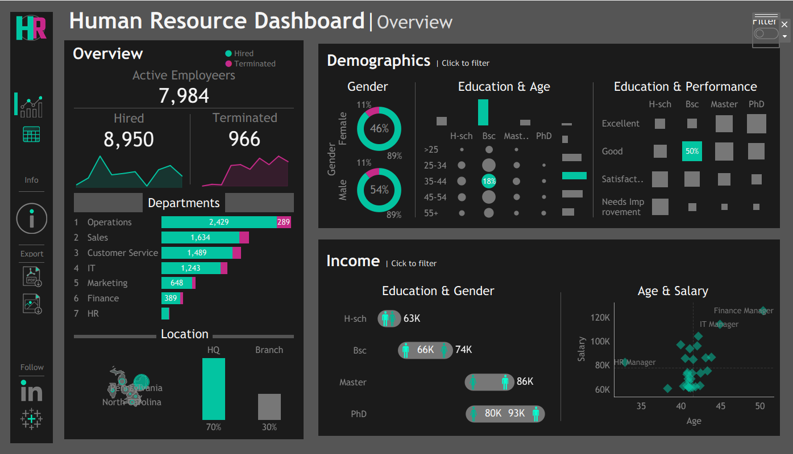

# 📊 HR Analytics Dashboard – Tableau Project

This project showcases a fully interactive **HR Analytics Dashboard** built in **Tableau**, designed to simulate real-world data visualization for workforce analytics. It enables exploration of key HR metrics such as hiring trends, demographics, performance ratings, and salary distribution — with clean design and user-friendly interaction.

---

## 🎯 Project Purpose

To demonstrate the power of **data visualization** in simplifying complex HR data for quick and effective decision-making. The dashboard is tailored for:

- Exploring hiring and attrition trends  
- Understanding employee demographics  
- Analyzing salary patterns and performance correlations  
- Accessing detailed employee records via an interactive table  

---

## 📊 Key Dashboard Features

### ✅ 1. Overview
- KPIs: Total hired, active, and terminated employees  
- Hiring/termination trends over time  
- Workforce breakdown by department, job title, city, and state  
- HQ vs. branch employee comparison  

### ✅ 2. Demographics
- Gender distribution  
- Age and education level breakdown  
- Performance ratings by education level  

### ✅ 3. Income Analysis
- Salary comparisons by gender and education level  
- Salary vs. age across departments  

### ✅ 4. Employee Directory
- Dynamic, searchable employee table  
- Filterable by department, gender, age, education, salary, etc.  

---

## 🌐 Live Dashboard

> 📍 [Click here to view the live dashboard on Tableau Public](https://public.tableau.com/shared/C3NYQQ76R?:display_count=n&:origin=viz_share_link)

Explore the fully interactive version of the HR Analytics Dashboard — hosted on Tableau Public.

---

## 📁 Included Files

- `HR_Dashboard.twbx` – Tableau workbook  
- `Employee_Data.csv` – Simulated employee dataset  
- `Icons/Assets` – Custom visuals used in the dashboard  
- `Mockups` – Layout and design sketches  

---

## 🧠 Tools & Technologies

- Tableau Public – Data visualization  
- Python Faker – Data simulation  
- Photopea – Icon customization  
- Procreate / draw.io / Figma – UI/UX mockup and background design tools  

---

## ⚙️ How to Use

1. Install [Tableau Public](https://public.tableau.com)  
2. Open the `HR_Dashboard.twbx` file  
3. Navigate through the dashboard sections  
4. Use filters and selectors to explore the data interactively  

---

## 📌 Insights Unlocked

- Track organizational hiring and attrition patterns  
- Discover demographic or pay gaps  
- Analyze salary distributions by department and age  
- View detailed employee records in one place  

---

## 🧠 About the Project

This project was developed as part of a hands-on learning exercise to build analytical dashboards using Tableau. The dataset was artificially generated and the entire workflow — from mockups to visuals — was designed from scratch to reflect a real business scenario.

---

## 📫 Let’s Connect

Have questions or want to collaborate?

- 📧 **Email:** korosbrian574@gmail.com  
- 📞 **Phone:** +254 768 518 488  
- 💼 **LinkedIn:** [Brian Kimutai](https://www.linkedin.com/in/brian-kimutai-0888352b6/)  
- 📊 **Tableau Public:** [View My Dashboards](https://public.tableau.com/shared/C3NYQQ76R?:display_count=n&:origin=viz_share_link)  
- 💻 **GitHub:** [kimutai99](https://github.com/kimutai99)

---

✅ *Ready to explore real data with real insights.*
